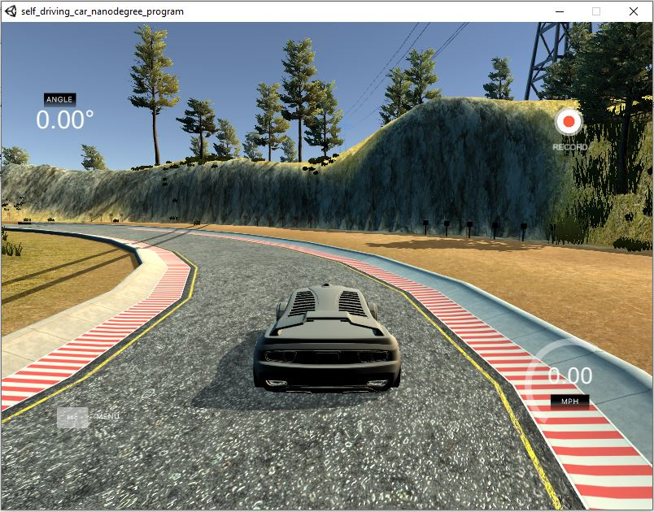
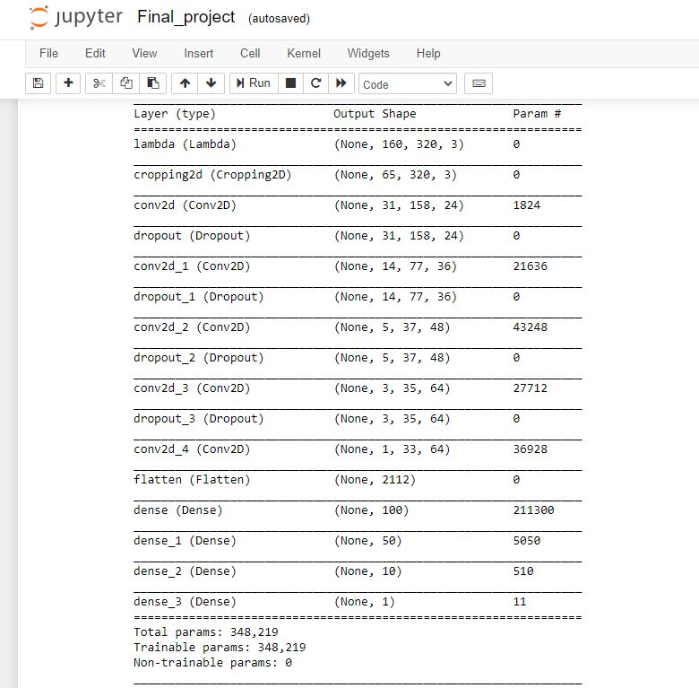
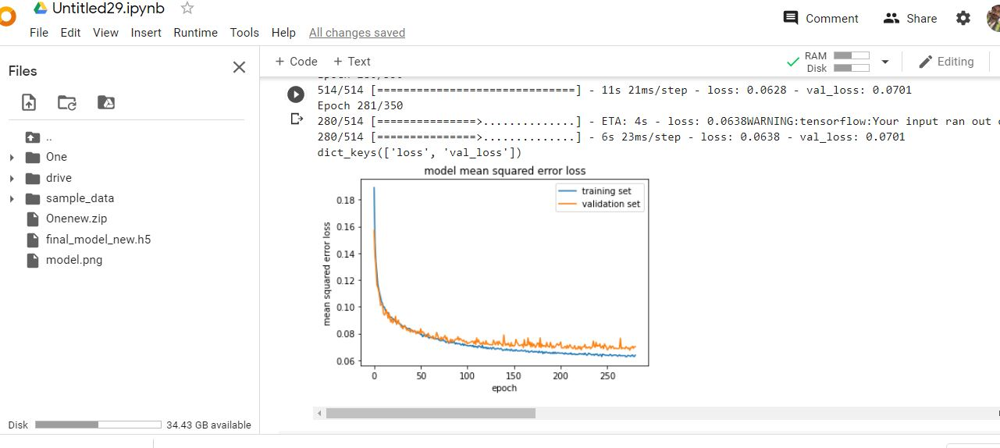

# Behavioral Cloning Project

<h1> Overview </h1>

 The project focusses on training the car how to steer a car in road by cloning the behaviour of the driver. The train set is collected with different images from the car's cameras
and the corresponding driver's action on the steering wheel. The data is collected from the car driven in the Udacity's simulation environment consisting of 2 tracks one with basic
curves and other with very much advanced curves and lanes. A suitable deep learning model is used to clone the behavior and finally the model is testing in the simulation environment
to drive autonomously by controlling the steering angle alone with constant speed. 

<h1> Dataset Preparation </h1>

 The dataset in total consists of 49158 samples of the images and the corresponding steering angles. The car is driven in both the tracks to generalize the dataset much better.
The car consists of 3 cameras in the front (i.e) left,center and right to collect the data. The car is driven accross the track with movement keys and the data is collected for 
each frame.

 The key idea here is that instead of using only the center camera images to calculate the steering angles (for which the data is significantly less and requires more driving), 
we add or subtract some offest (in this case it is 0.2) to the steering angles for the left and right camera images. From the image above, we can see that for the right camera images
the steering angles needed to be added with the offset and similarily for the left camera images the steering angle needs to be subtracted by the offset. The enables us with more
data to train and also provides us with different prespective of the images and their corresponding decision of steering angles as well.

<h3> Techniques Used to Collect dataset </h3>

<UL>
  <LI> The car is driven in the first track from start position to end position in anticlockwise direction </LI>
  <LI> The car is driven in the first track from start position to end position in clockwise direction </LI>
  <LI> The above two is done for second track as well </LI>
  <LI> The car is driven again in both tracks only in the areas of sharp turns </LI>
  <LI> The car is also driven in both tracks for two lanes in both direction </LI>
</UL>

 These above techniques enable us to handle most of the cases while autonomous driving. Finally the images before feeding to the model are mean normalized as a step of 
preprocessing techniques. Also when we look at the images we may notice that there are many unwanted distractors in the top and bottom of the image including trees,clouds and
car front. These may confuse the model to be taken as features. So we crop the top and bottom part thereby feeding only the lanes to the model.

<h1> Model Architecture </h1>

 The Nvidia model architecture is used to perform the behavioral cloning. The model takes in left,right and center camera images one at a time with the significant offset added
to the steering angle data. The first two layers in the model are modified to perform the mean normalization and cropping. The model used convolution layers with a stride of 2
and a non linear activation function of Relu. With the abundant amount of the data the model did overfit in the previous training causing an increased validation loss of 0.3 
while the train loss being 0.09. A suitable dropout layer with dropout rate of 0.5 is added in between the convolution layers to prevent the overfitting problem. After 5 layers
of convolution we add 3 dense layers after flattening the output. Finally a single dense layer is added to make the steering angle prediction. The model.png files shows the 
model flow chart.
 

<h3> Model Summary </h3>

 

 The model is being trained for 280 epochs with Adam optimizer with the default learning rate of 0.001. The loss function used is Mean Squared Error. The train set and test
set is splitted using sklearn's train_test_split library with test size being 33% of total dataset. Out of the 67% train set 20% is allocated for eval set. The train set is also
shuffled randomly for training with a batch size of 64. he final train MSE being 0.0638, validation MSE being 0.0701 and test MSE being 0.069. 

 

